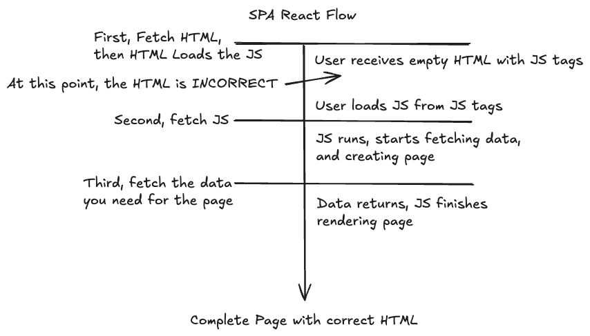
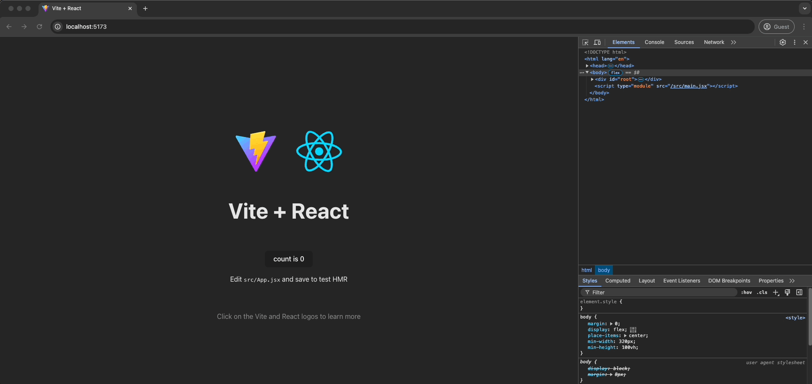
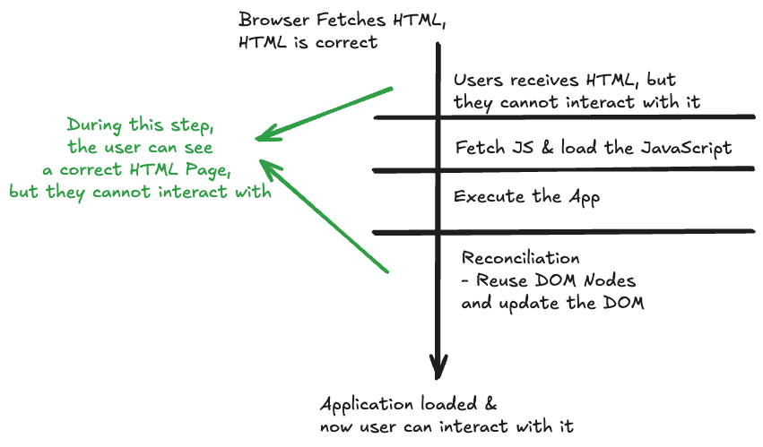
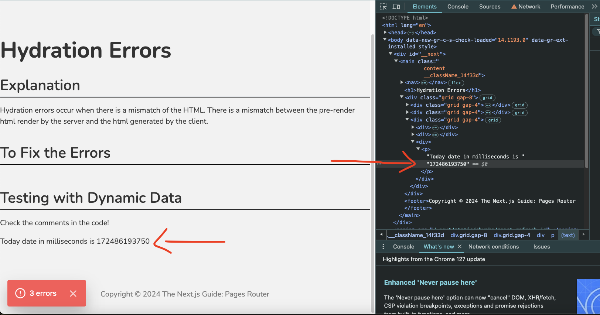
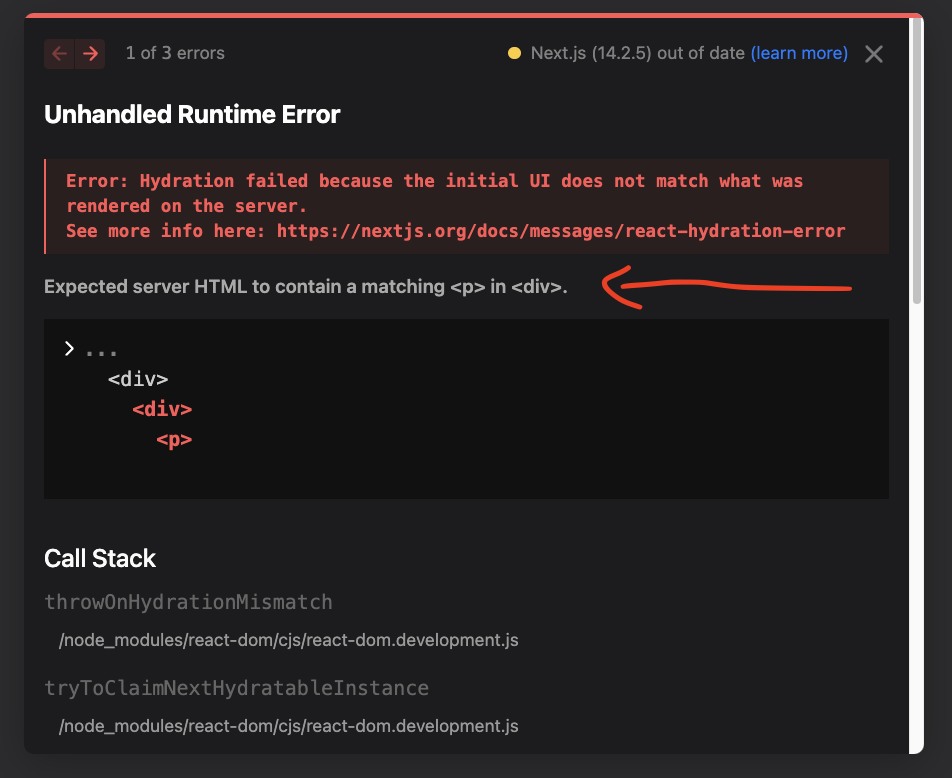
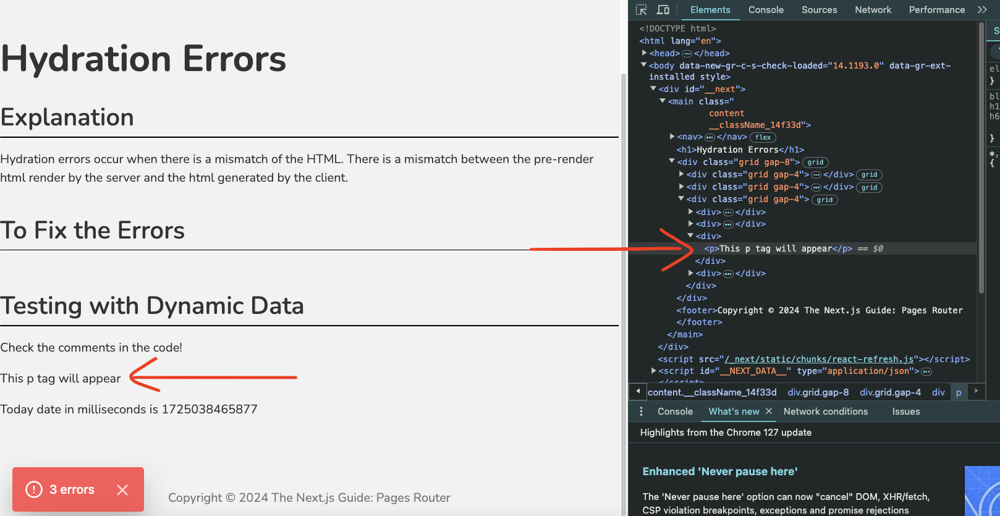
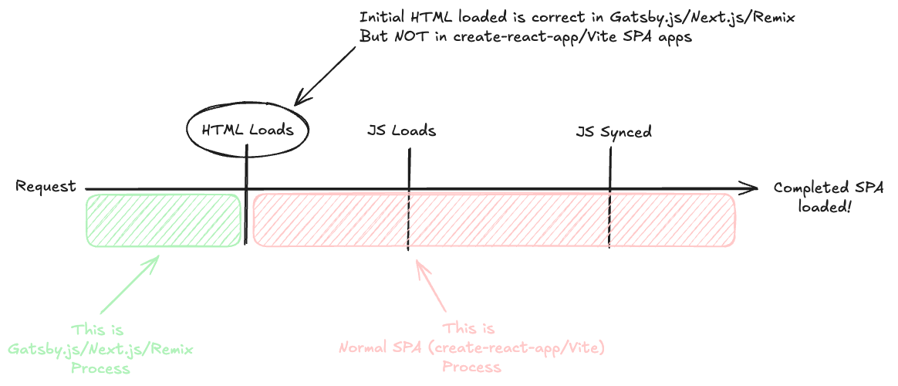

# What is Pre-Rendering & Hydration?

_By Salvador Villalon_

Pre-rendering and Hydration represent significant advancements in the history of web development. Frameworks like [Next.js](http://next.js), [Gatsby.js](http://gatsby.js), and [Remix](https://remix.run/) leverage these concepts to create toolchains that build efficient web applications. This article will discuss Pre-rendering and Hydration and why they are important additions to the single-page application process.

To understand these concepts, we need to explore why they were created and what problem they are trying to solve. Let's take a look at the beginning of web applications.

## Web Development in the Past: Traditional Server-Side Rendering

Rendering and interactivity were separated. We used languages like [Node.js](https://nodejs.org/en), [PHP](https://www.php.net/), [Java](https://www.java.com/en/), and [Ruby on Rails](https://rubyonrails.org/) as our server-side languages. Within our servers, we created **views** using templating languages like [JSP](https://en.wikipedia.org/wiki/Jakarta_Server_Pages) and [EJS](https://ejs.co/). Views are HTML pages and you could inject JavaScript or Java inside them to add functionality, dynamic data retrieved from database queries, and interactive segments with languages like [JQuery](https://jquery.com/).

### The Downside of Traditional Server-Side Rendering

**Performance Issues**

-   A request to the server needs to be made every time the user requests a page!
    -   This means there will be a full-page reload.
    -   Complex queries can result in slower speeds.

**Scalability Challenges**

-   **Global Reach**: A **Dynamic CDN** is needed to cache your dynamic files. CDNs are better suited for static content, but companies like Cloudflare created [Cloudflare-Workers](https://www.cloudflare.com/products/cloudflare-workers/) to help with the process.
-   **Upscaling Servers**: If more users start using the application, there will be an increase in demand on the server. You might need to invest more in resources such as scaling up by adding more servers.

**Duplicate Logic**

-   You will have duplicate code. For example, if you're trying to validate form fields, you'll have to validate in both the EJS file and your API endpoint.

### Example

**Code in EJS:**

```
<form action='/submit-form' method='POST' id="myForm">
	<label for="email">Email:</label>
	<input type="email" id="email" name="email" />
	<button type="submit">Submit</button>
</form>

<script>
	document
		.getElementById('myForm')
		.addEventListener('submit', function (event) {
			const email = document.getElementById('email').value;

			if (!email.includes('@')) {
				alert('Please enter a valid email.');
				event.preventDefault();
			}
		});
</script>
```

**Code in Express.js**

```
import express from "express";
const app = express();
const path = require("path");
const port = 3000;

// To received form data
app.use(
  express.urlencoded({
    extended: true,
  }),
);

// view engine setup. Need a folder called views
app.set("views", path.join(__dirname, "views"));
app.set("view engine", "ejs");

app.get("/", (req, res) => {
  // To render the view
  res.render("index", { errors: null });
});

app.post("/submit-form", (req, res) => {
  const email = req.body.email;

  if (!email.includes("@")) {
    res.status(400).send("Invalid email.");
    return;
  }
  // Proceed with form processing
});

app.listen(port, () => {
  console.log(`Sandbox listening on port ${port}`);
});
```

Traditional Server-Side Rendering had significant downsides, but the introduction of **single-page applications** marked a new era in web development.

## Traditional Server-Side Rendering vs. Single-Page Applications

Traditional Server-Side Rendering had significant downsides, but the introduction of single-page applications marked a new era in web development.

### History of Single Page Applications (SPA)

#### What is a Single Page Application (SPA)?

A Single-page application (SPA) is a web app implementation that loads only a single web document and then updates the body content of that single document via JavaScript APIs such as Fetch when different content is to be shown. Allows users to use websites without loading whole new pages from the server. ([Source: MDN](https://developer.mozilla.org/en-US/docs/Glossary/SPA))

React was a game-changer! React enables the creation of fast applications and simplifies updating the UI easier than DOM manipulation methods. It offers several advantages:

-   **Improved User Experience**

    -   SPA loads a single HTML file and dynamically updates the content as the user interacts with it. All of this is done without a full page reload.
    -   SPA can update the state of the UI easily and provide instant feedback to users based on actions taken on the app.

-   **Reduce Server Load**

    -   Most of the work is done by the browser. This reduces the load on the server!

-   **Better Scalability**
    -   The browser is now doing most of the work. We can now deploy dedicated servers focused on serving data via APIs! We can easily scale horizontally. We have the option of using servers or serverless functions like [AWS lambda](https://aws.amazon.com/lambda/).
    -   An SPA can be hosted on a static CDN like [Netlify](https://docs.netlify.com/platform/what-is-netlify/).

With the addition of toolchains like [Vite](https://vitejs.dev/) and [Create React App](https://create-react-app.dev/) to automate the setup of a modern JavaScript application, engineers no longer had to worry about configuring Webpack manually.

There are some downsides to implementing apps with just Vite and Create React App. The big one is that it relies on the browser to load all the JavaScript and HTML for us. This means that on mobile devices and slow internet, users may experience delays in seeing the page. Let’s examine the flow to explain this:

### Single Page Application Flow

<figure style='text-align: center';>
  
  <figcaption><a href='https://www.youtube.com/watch?v=d2yNsZd5PMs&t=1s'>(Source: How NextJS REALLY Works)</a></figcaption>
</figure>

Several steps are needed for the users to finally see the HTML page! First, the browser fetches the HTML. This initial HTML will be blank and incorrect. Why? Because the content comes from JavaScript. This means that it takes time for the browser to fetch JavaScript, load it, and execute it. Since the initial HTML is wrong, web crawlers and search engines will not find relevant content on the website and skip it.

Take a look at this GIF. Here we disable JavaScript on the Chrome Developer Tools. The website fails to load without JavaScript. If JavaScript is enabled but the internet connection is slow, users may see a blank page for an extended period.

<figure style='text-align: center';>
  
</figure>

This was a big problem. This led to Web Development evolving into **the Pre-Rendering era.**

## Entering a New World with Pre-Rendering and Hydration

### Why is Pre-Rendering Important?

People realized that we could generate the HTML in advance. It could be generated from our server or at build time, depending on the methods used.

Pre-rendering can be done in two ways - [Server Side Rendering (SSR)](https://nextjs.org/docs/pages/building-your-application/rendering/server-side-rendering) or [Static Site Generation (SSG)](https://nextjs.org/docs/pages/building-your-application/rendering/static-site-generation)

### What is Server Side Rendering?

React components are rendered on the server, and the resulting HTML is sent to the browser. This can improve SEO and initial load times. **The rendering process occurs on each page request.**

### What is Static Site Generation (SSG)?

**Static HTML pages are generated at build time.** These pages can be served quickly without requiring a server to render them on the fly.

Either method is beneficial! **Now the HTML that the user receives will be correct.** They will see a page with content instead of a blank page as seen using Vite or Create React App. But there is a problem: the HTML the user receives is not interactive! They cannot click on it or submit a form. How can we add interactivity to our app? By Hydrating properly 🚰 🌊!

### What is Hydration? 

[Hydration](https://react.dev/reference/react-dom/hydrate#hydrating-server-rendered-html) is what adds interactivity to our app, it loads the JavaScript that makes our app interactive.

In React, "hydration" is how React "attaches" to existing HTML that was already rendered by React in a server environment. During hydration, React will attempt to attach event listeners to the existing markup and take over rendering the app on the client. ([Source: React Docs](https://react.dev/reference/react-dom/hydrate#hydrating-server-rendered-html))

Let's see what the flow looks like for an app that uses Pre-Rendering and Hydration:

<figure style='text-align: center';>
  
</figure>

### What is Reconciliation?

Reconciliation is the process by which React determines the most efficient way to update the UI in response to changes in data or component hierarchy. ([Source: What is the difference between virtual and real DOM (React)?](https://www.educative.io/answers/what-is-the-concept-of-reconciliation-in-react))

Reconciliation is when React figures out how to update the UI in response to changes in data or components hierarchy.

When components are rendered a Virtual DOM is created. If there are changes in state or props, then a new Virtual DOM is created. React then uses its diff algorithm to compare the new Virtual DOM with the previous Virtual DOM to check for changes. This is reconciliation.

Based on the changes found, React is not going to update the entire UI, instead, it will select which elements need to be updated! This article helped me understand Reconciliation.

### Pre-rendering and Hydration in Action

Now we know that during the Pre-rendering and Hydration flow, first, the user will see HTML with the correct content.

Then Hydration kicks in and loads JavaScript to give interactivity to the application!

Let's simulate the process of what happens if the Hydration process takes a long time (due to a slow internet connection) or if the user has JavaScript disabled. Here is a gif where I disable JavaScript on my Portfolio. I created my portfolio using [Gatsby](https://www.gatsbyjs.com/) a **static-site-generation framework. (it also have server-side rendering capabilities)**

<figure style='text-align: center';>
  
</figure>

Even though there is no JavaScript, I can still see content on my portfolio. That's because the user received **pre-render HTML**! You can see that I cannot click on the **dropdown menu items** or the **buttons** that say About Me, Projects, and Experience. That's because the JavaScript did not load so the user cannot interact with it.

### A Mental Model for Hydration

[Josh Comeau](https://www.joshwcomeau.com/) created a cool mental model for Hydration. Josh calls it the **"Two Pass Rendering."**

The first pass, at compile-time, produces all of the static non-personal content and leaves holes where the dynamic content will go. Then, after the React app has mounted on the user's device, a second pass stamps in all the dynamic bits that depend on the client state. (Source: [The Perils of Hydration](https://www.joshwcomeau.com/react/the-perils-of-rehydration/#mental-models-13))

To Summarize:

1.  **The First Pass:** the user sees the pre-render HTML. It contains static content, but it is missing the dynamic content.

2.  **The Second Pass:** JavaScript starts loading and fills in the missing dynamic pieces that depend on the client state.

### Potential Errors when working with Pre-rendering and Hydration Frameworks

#### Hydration Errors

When working with frameworks like Next.js, the server will return static pre-render HTML, then Hydration occurs loading JavaScript.

However, we have to be careful when working with client-only properties and dynamic data. For example, take a look at this code

##### Dynamic Data Error

```
function HydrationErrors() {
  return (
    <>
      <h1>Hydration Errors</h1>

      <div>
        <p>Today date in milliseconds is {new Date().getTime()}</p>
      </div>
    </>
  );
}
```

Here the server will generate HTML with a timestamp in milliseconds. For example: **`1724869161034`**. The Hydration process begins, and then the client loads the HTML. Time has passed and the timestamp is different, it is now **`172486193750`**! This scenario causes the following error:

<figure style='text-align: center';>
  
  <figcaption>Error received for having the wrong timestamp generated for client and server</figcaption>
</figure>

This happens because the `getTime()` function will generate a different timestamp!

This means that the server and client generate different HTML. The Network Tab shows us the server's response. It is a different HTML from what the client loads!

<figure style='text-align: center';>
  
  <figcaption>The Server's Response</figcaption>
</figure>

<figure style='text-align: center';>
  
  <figcaption>The Client's Response</figcaption>
</figure>

##### To Fix the Error

```
function HydrationErrors() {
  const [date, setDate] = useState<number>();

  useEffect(() => {
    setDate(new Date().getTime());
  }, []);

  return (
    <>
      <h1>Hydration Errors</h1>

      <div>
        <p>Today date in milliseconds is {date}</p>
      </div>
    </>
  );
}

```

We can use the `useEffect` hook. Why would this work? Because the HTML that the server and client render will contain an empty `date` state variable.

Once the component mounts, the `useEffect` activates and adds the dynamic data from the state variable or you can use the `suppressHydrationWarning` flag and set it to true.

##### Using Client-Only Properties Error

Remember you cannot use `window` or `localStorage`. They do not exist on the server. Take the following example:

```
function HydrationErrors() {
  return (
    <>
      <div>
        {typeof window !== "undefined" && <p>This p tag will appear</p>}
      </div>
    </>
  );
}
```

Here the server returns an HTML with an empty `<div>` tag, but the client loads HTML that includes the `<p>` tag! This creates a

<div style='text-align: center';>
    <b style='font-size: 4rem';>HYDRATION ERROR!</b>
</div>

This is a error that you get.

<figure style='text-align: center';>
    
    <figcaption>Error received for using client-side properties</figcaption>
</figure>

The Network Tab shows us the server's response and it is an empty `<div>` tag.!

<figure style='text-align: center';>
    
    <figcaption>Client's response</figcaption>
</figure>

but the client loads HTML that says "This p tag will appear"

<figure style='text-align: center';>
    
    <figcaption>Server's response</figcaption>
</figure>

This demo was inspired by Deeecode The Web in [Why Do HYDRATION ERRORS Exist? And how to solve them](https://youtu.be/7UOyuEHYmSE?si=Ql8z5D_pAryvTyFf). He gives a great explanation of why Hydration Errors occur. I recommend watching it!

## How does it relate to frameworks like Gatsby.js, Next.js, and Remix? 

Everything we have discussed is what all these frameworks focus on!

Static-Site Generation and Server-Side Rendering can be implemented using Gatsby.js, Next.js, and Remix. Both focus on creating a pre-render HTML ready for the user to see, then initiate Hydration to add interactivity to the app.

Gatsby.js, Next.js, and Remix do not replace the concept of single-page applications, they add to the process. Take a look at this flow:

<figure style='text-align: center';>
  
  <figcaption><a href='https://www.youtube.com/watch?v=d2yNsZd5PMs&t=1s'>(Source: How NextJS REALLY Works)</a></figcaption>
</figure>

It is adding to the current SPA flow! If we did not have Pre-rendering then the process starts where the pink box begins, with an incomplete HTML.

## Conclusion

Thanks for reading this far 😃!

I learned a lot from writing this article. I started this research because I used Gatsby to create my [portfolio version 4](https://salvador-villalon.netlify.app/) and Next.js in my job, but I did not understand the concepts behind these frameworks and why they were created.

I made a web application to demonstrate the topics covered in the article.

-   Application: <https://the-nextjs-pagesrouter-guide.vercel.app/>

-   GitHub Repo: <https://github.com/salvillalon45/the-nextjs-pagesrouter-guide>

In the GitHub repo you can find the code snippets for:

-   A page implementing getStaticProps and getStaticPaths

-   A page implementing getStaticProps

-   A page implementing getServerSideProps with Client Side fetching

-   A page to demonstrate Hydration Errors
-   Using the api directory to implement our own api routes

## Resources

### Learning about Hydration

-   [What is Hydration](https://youtu.be/R-BKadZWYnQ?si=imNFJL36knSPdF7S) by Builder (Watch this one first it explains the difference between SPA and the Pre-rendering process)

-   [What Exactly is REACT HYDRATION? And why does it matter?](https://youtu.be/87i0pejrULw?si=e179x9x2KkaR8AxL) by Deeecode The Web

-   [Why Do HYDRATION ERRORS Exist? And how to solve them](https://youtu.be/7UOyuEHYmSE?si=Ql8z5D_pAryvTyFf) by Deeecode The Web

-   [The Perils of Hydration](https://www.joshwcomeau.com/react/the-perils-of-rehydration/) by Josh W Comeau

-   [Hydrate](https://react.dev/reference/react-dom/hydrate#hydrating-server-rendered-html) by React Docs

### Learning about Next.js

-   [The Story of Next.js](https://youtu.be/BILxV_vrZO0?si=AgzODMDFOjSx5a3w) by Uidotdev (Watch to understand why Next.js was created)

-   [How NextJS REALLY Works](https://youtu.be/d2yNsZd5PMs?si=UZYKHUrajdXQd1y4&t=1) by Theo

### Learning about getServerSideProps and getStaticProps

-   [Next.js - GetServerSideProps vs GetStaticProps](https://youtu.be/xfX8nVpaycU?si=ZV-r2piDoWhLAKMi) by Morado Web Development

    -   This video gave a clear demonstration of how the functions work! It inspired how to create this tutorial.

### Learning about Reconciliation

-   [What is the concept of reconciliation in React?](https://www.educative.io/answers/what-is-the-concept-of-reconciliation-in-react) by educative.io
